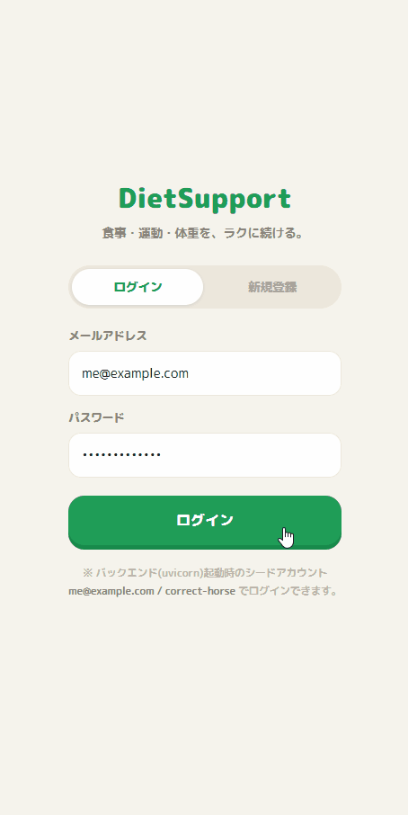

# DietSupport

食事・運動・体重の3本柱を「ラクに続けられる」ことを主眼にした、ダイエット支援の個人向け **PWA**。<br>
スマホのホーム画面に置けば、ふだん使いのアプリとして全画面で記録できます。

---

## デモ

<p align="center">
  
</p>

---

## できること

| 画面 | 何ができるか |
|------|------------|
| **ホーム** | きょうの「食事・運動・体重」の達成(◎○)、3つ揃いの状態、ストリーク(連続記録日数)、カロリー進捗をひと目で確認。空いた日からの再開もここから。 |
| **食事** | 固定メニューを1タップで記録。数量調整・前回履歴のコピー・外食の手入力に対応。朝/昼/夕/間食ごとに記録でき、◎○は入力中にその場で判定。 |
| **体重** | ±0.1kg ステッパーで素早く入力。目標との差分と推移グラフを表示。測定すれば◎。 |
| **筋トレ** | その日の予定種目に重量/回数/セットを入力。前回値をワンタップでコピー。予定どおりやれば◎、休んでも「○を残す」で記録は続く。 |
| **カレンダー** | 月ごとの◎○とストリークを俯瞰。過去の日をタップすればその日の詳細を見て、後からまとめて記録(遡及入力)できる。 |
| **ダッシュボード** | 体重の折れ線に運動日と目標線を重ねた統合ビュー。傾向を数値で確認。 |
| **マスタ管理** | 固定メニュー・トレーニング種目・実施予定の一覧/追加/編集/削除。 |
| **設定** | 目標(カロリー・PFC・目標体重)、通知のオン/オフ、バックアップの書き出し/復元、記録の全削除。 |

### 続けやすくする工夫
- **◎○の2段階評価** — 「完璧(◎)」だけでなく「やった(○)」も肯定。ハードルを下げて継続を後押し。
- **ストリーク(連続記録)** — 連続日数と最長記録を表示。あいだが空いても、1つ記録すれば復活します。
- **オフラインでも使える** — 電波がなくても記録・閲覧でき、オンライン復帰時に自動で同期。

---

## はじめ方

### スマホで使う(iPhone・同じ Wi-Fi の PC を立ち上げておく方式)

ふだん使いのおすすめは、PC をローカルサーバーにして iPhone から LAN 経由でアクセスする方法です。<br>
**iPhone と PC を同じ Wi-Fi につないでください。**

**macOS / Linux**
```bash
# 1) バックエンド(認証・同期)を LAN へ公開
PYTHONPATH=. .venv/bin/uvicorn server.app.main:app --host 0.0.0.0 --port 8000

# 2) フロントを LAN へ公開
npm run dev -- --host          # 表示される "Network: http://<PC-IP>:5173/" を使う
```

**Windows(PowerShell)**
```powershell
# 1) バックエンド(認証・同期)を LAN へ公開
$env:PYTHONPATH="."; .venv\Scripts\uvicorn server.app.main:app --host 0.0.0.0 --port 8000

# 2) フロントを LAN へ公開
npm run dev -- --host          # 表示される "Network: http://<PC-IP>:5173/" を使う
```

iPhone の Safari で **`http://<PC-IP>:5173`** を開きます(`<PC-IP>` は上の Network 行のアドレス。<br>
macOS は `ipconfig getifaddr en0`、Windows は `ipconfig`(Wi-Fi アダプタの「IPv4 アドレス」)でも確認できます)。共有メニュー →「ホーム画面に追加」で全画面のアプリアイコンになります。

> つながらないときは、PC のファイアウォールで受信が許可されているか確認してください。<br>
> macOS: システム設定 → ネットワーク → ファイアウォール / Windows: 設定 → ネットワークとインターネット → Windows ファイアウォール(初回起動時にダイアログが出たら「アクセスを許可する」を選択)。

### PC だけで使う

**macOS / Linux**
```bash
# 1) バックエンド(認証・同期。SQLite に永続化)
PYTHONPATH=. .venv/bin/uvicorn server.app.main:app --port 8000

# 2) フロント
npm run dev                          # → http://localhost:5173
#   もしくは「インストール可能な PWA」として:
npm run build && npm run preview     # → http://localhost:4173
```

**Windows(PowerShell)**
```powershell
# 1) バックエンド(認証・同期。SQLite に永続化)
$env:PYTHONPATH="."; .venv\Scripts\uvicorn server.app.main:app --port 8000

# 2) フロント
npm run dev                          # → http://localhost:5173
#   もしくは「インストール可能な PWA」として:
npm run build; npm run preview       # → http://localhost:4173
```

`http://localhost:4173`(preview)はブラウザの **インストール** アイコン、または Chrome の ⋮ →「アプリをインストール」でアプリ化できます(オフライン動作込みのフル PWA になります)。

### ログイン
初回はシードアカウント **`me@example.com` / `correct-horse`** でログイン(新規サインアップも可)。<br>
以後はトークンが保存され、次回からはそのまま使えます。

---

## データとバックアップ

- **保存場所** — 記録は端末内(ブラウザの IndexedDB)とサーバー(SQLite)に保存されます。1台だけで使うなら同期は不要です。
- **バックアップ** — 設定 →「バックアップを書き出す」で全データを JSON に出力。機種変更や端末故障のときは「バックアップから復元」で戻せます。**記録を消す前に書き出しておくと安心です。**
- **全削除** — 設定 →「記録をすべて削除」で食事・運動・体重・達成スタンプ(ストリークの元データ)を消去します。固定メニュー・種目・目標・通知設定は残ります。**この操作は取り消せません。**

---

## iPhone でフル PWA(オフライン込み)を試す

iOS は Service Worker / 正式な PWA インストール / オフライン機能に **HTTPS または localhost** を要求します。<br>
上記の `http://<PC-IP>` でも記録・閲覧・ホーム画面追加はできますが、オフライン動作は無効です。<br>
オフラインまで試したい場合は HTTPS トンネルが手軽です。

**macOS / Linux**
```bash
npm run build && npm run preview -- --host     # :4173 を起動
cloudflared tunnel --url http://localhost:4173 # 発行される https://xxxx... を iPhone で開く
```

**Windows(PowerShell)**
```powershell
npm run build; npm run preview -- --host       # :4173 を起動
cloudflared tunnel --url http://localhost:4173 # 発行される https://xxxx... を iPhone で開く
```

(ngrok など他のトンネルでも可。発行された HTTPS URL なら Service Worker が有効になりフル PWA になります)

---

## 本番(外部公開)で動かす場合の環境変数

自分のマシンだけで使うなら不要です。サーバーをインターネットに公開するときは最低限これらを設定します。

| 変数 | 説明 |
|------|------|
| `DIETSUPPORT_ENV=production` | 安全側の設定を有効化。 |
| `DIETSUPPORT_JWT_SECRET=<十分に長い秘密鍵>` | **必須**。`production` で未設定だとサーバーは起動しません。 |
| `DIETSUPPORT_ALLOWED_ORIGINS=https://<本番ドメイン>` | CORS 許可オリジン(カンマ区切り)。 |
| `DIETSUPPORT_DB=<DBパス>` | DB ファイルのパス(既定 `dietsupport.db`)。 |

> 秘密鍵(`DIETSUPPORT_JWT_SECRET`)・記録データ(`*.db`)・`.env` は `.gitignore` 済みで、リポジトリには含まれません。本番の秘密鍵は必ず環境変数で別管理してください。

---

## セットアップ(初回のみ)

**macOS / Linux**
```bash
# フロント
npm install

# バックエンド(Python 仮想環境)
python3 -m venv .venv && .venv/bin/pip install -r requirements.txt
```

**Windows(PowerShell)**
```powershell
# フロント
npm install

# バックエンド(Python 仮想環境)
python -m venv .venv; .venv\Scripts\pip install -r requirements.txt
```

---

## 開発者向け

設計・アーキテクチャ・テスト仕様・残タスクは別ドキュメントにまとめてあります。

- アーキテクチャと開発の鉄則、残タスク: [HANDOFF.md](HANDOFF.md)
- 設計ダイジェスト: [DESIGN_DIGEST.md](DESIGN_DIGEST.md)
- テスト実行: `npm test`(TypeScript) / `python3 -m pytest`(サーバー。Windows は `python -m pytest`)

---

## 著作権・利用条件

Copyright © 2026 kaz-1982. **All Rights Reserved.**

個人開発・自分用のプロジェクトです。<br>
OSS ライセンスは付与していないため、閲覧目的以外での複製・改変・再配布・商用利用は許可していません。<br>
利用を希望する場合は作者へ連絡してください。
